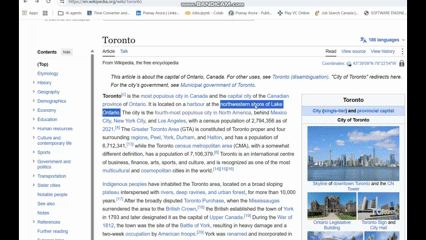

# AskAI ✨

A lightweight Chrome extension that lets you highlight text on any webpage, right-click **AskAI**, and get an AI-generated response directly on the page.

AskAI runs completely locally using a **Qwen GGUF model** through a Node.js backend. No OpenAI API key or cloud AI service is required.
<p align="center">
  
</p>
---

## ✨ Features

- 🖱️ Highlight text on any webpage
- ✨ Right-click → **AskAI**
- 🤖 Generate responses using a local Qwen model
- 🔒 Keep prompts and responses local
- 🌐 Display responses directly on the current webpage
- ⚡ Lightweight Chrome Extension
- 🧠 GGUF model support through `node-llama-cpp`
- 💻 Runs entirely on your computer
- 🔑 No API keys required

---

## 🏗️ Architecture

```text
┌───────────────────────────────┐
│         Chrome Browser        │
│                               │
│  Highlight text               │
│       ↓                       │
│  Right click → AskAI ✨       │
│       ↓                       │
│  Inline AI response           │
└───────────────┬───────────────┘
                │
                │ HTTP
                ▼
┌───────────────────────────────┐
│        Node.js Backend        │
│                               │
│           Express             │
│              ↓                │
│       node-llama-cpp          │
└───────────────┬───────────────┘
                │
                ▼
┌───────────────────────────────┐
│       Local Qwen GGUF         │
│                               │
│ Qwen2.5-1.5B-Instruct         │
└───────────────────────────────┘
